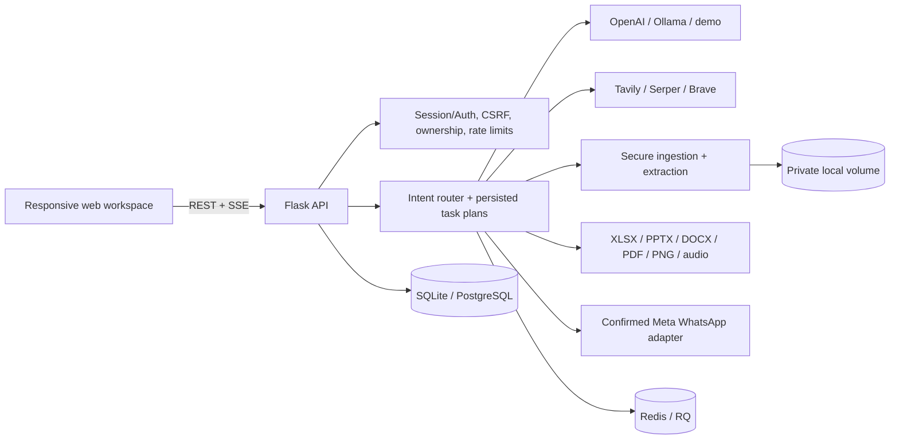
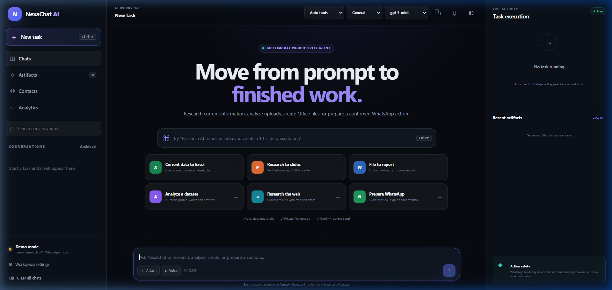
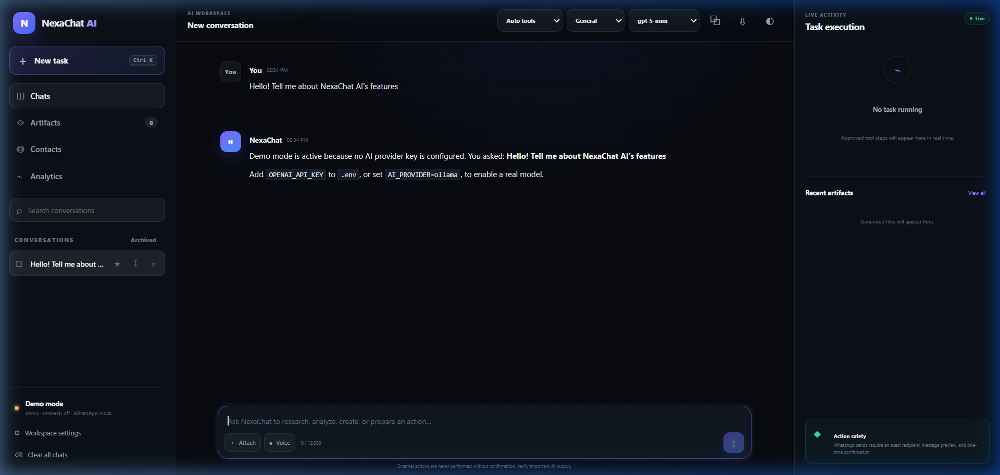
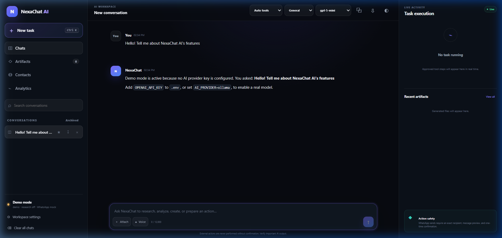

# NexaChat AI

NexaChat AI is a full-stack multimodal AI workspace: conversational assistance, source-backed live research, document understanding, professional Office/PDF generation, voice input/output, private contacts, and explicitly confirmed WhatsApp delivery in one responsive web application.

It is designed as a production-minded portfolio project. Real external actions are visible and auditable, current facts are never silently fabricated in demo mode, and generated artifacts are validated before download.

## What works

- Streaming OpenAI, Ollama, and deterministic no-key demo chat
- Plan-first task execution with persisted steps, tool runs, status events, cancellation, and analytics
- Live research through Tavily, Serper, or Brave with deduplicated citations and safe current-data refusal when no provider is configured
- PDF, DOCX, PPTX, XLSX, CSV, JSON, text, image, and audio uploads with size, extension, signature, ZIP-expansion, and ownership checks
- Excel, PowerPoint, Word, PDF, PNG chart, audio, and Markdown artifact generation
- Voice recording, pause/resume, preview, transcription, editable transcript, and text-to-speech
- Encrypted contacts, CSV import, search, edit, and per-owner isolation
- Meta WhatsApp Cloud API text and original-audio delivery with an exact recipient/content confirmation gate; mock mode never sends externally
- Searchable/pinnable/archivable chats, explicit user memory, light/dark themes, mobile layouts, and keyboard shortcuts
- PostgreSQL/SQLite persistence, Redis rate limits and RQ jobs, migrations, metrics, Docker Compose, CI, and security tests

## Architecture



The request lifecycle and trust boundaries are detailed in [ARCHITECTURE.md](docs/ARCHITECTURE.md).

## Technology stack

Python 3.12, Flask, SQLAlchemy/Alembic, OpenAI/Ollama, PostgreSQL/SQLite, Redis/RQ, server-rendered HTML, modern JavaScript, SSE, openpyxl, python-pptx, python-docx, ReportLab/pypdf, Meta WhatsApp Cloud API, Docker/Gunicorn, Prometheus/Grafana, pytest, mypy, Ruff, Bandit, pip-audit, and GitHub Actions.

## Quick start on Windows

Prerequisites: Python 3.12+, Node.js for the JavaScript syntax check, and optionally Docker Desktop.

```powershell
Copy-Item .env.example .env
python -m venv .venv
.\.venv\Scripts\Activate.ps1
python -m pip install -r requirements-dev.txt
flask --app app.py db upgrade
python app.py
```

Open `http://127.0.0.1:5000`. With the example defaults the app uses SQLite, demo AI, demo search, local private storage, and mock WhatsApp; no paid credential or external message is required.

## Enable real providers

Edit `.env` and restart the application.

OpenAI chat, transcription, and speech:

```env
AI_PROVIDER=openai
OPENAI_API_KEY=your_key
OPENAI_MODEL=gpt-5-mini
TRANSCRIPTION_MODEL=gpt-4o-mini-transcribe
TTS_MODEL=tts-1
```

Live search (choose one):

```env
SEARCH_PROVIDER=tavily
TAVILY_API_KEY=your_key
```

Use `serper` with `SERPER_API_KEY`, or `brave` with `BRAVE_SEARCH_API_KEY`. `SEARCH_PROVIDER=demo` intentionally refuses current rankings, prices, weather, news, and other live claims.

Real WhatsApp:

```env
WHATSAPP_MODE=meta
META_WHATSAPP_ACCESS_TOKEN=your_system_user_token
META_WHATSAPP_PHONE_NUMBER_ID=your_phone_number_id
META_WHATSAPP_BUSINESS_ACCOUNT_ID=your_business_account_id
META_WHATSAPP_WEBHOOK_VERIFY_TOKEN=your_random_verify_token
META_APP_SECRET=your_meta_app_secret
META_GRAPH_API_VERSION=v23.0
```

Set the Meta webhook callback to `https://your-domain.example/api/whatsapp/webhook`. The UI still requires a fresh, exact confirmation before the provider call. See [DEPLOYMENT.md](DEPLOYMENT.md) for provider-console and production steps.

## Docker Compose

```powershell
Copy-Item .env.example .env
docker compose up --build
```

This starts the web process, RQ worker, PostgreSQL, and Redis. Persistent database, upload, and artifact volumes are retained by Compose.

## Representative workflows

- “Research the 5 richest people in the world and create an Excel report.”
- “Summarize the attached annual report and create a 10-slide board presentation.”
- “Analyze this CSV, calculate quarterly growth, and produce a chart.”
- “Record a voice note, transcribe it, edit the transcript, and draft a reply.”
- “Message Rahul on WhatsApp that I will be 20 minutes late.” The app prepares a pending action and shows recipient, masked number, message, and provider mode before enabling Send.

Current-data and multi-step tasks open a plan before execution. The right activity rail streams planning, searching, extracting, generating, validating, and completion events. Result cards expose sources and downloadable artifacts.

## Quality and security checks

```powershell
.\verify.ps1
python -m pytest --cov=app --cov-report=term-missing
python -m pip_audit -r requirements.txt
node --check static/js/app.js
docker compose config
docker build -t nexachat-ai .
```

CI runs formatting, linting, type checks, tests, coverage, Bandit, dependency audit, syntax validation, and a container build. See [SECURITY.md](SECURITY.md) for the threat model.

## Documentation

- [API reference](API.md)
- [Architecture](docs/ARCHITECTURE.md)
- [Deployment](DEPLOYMENT.md)
- [Security](SECURITY.md)
- [Contributing](CONTRIBUTING.md)
- [Demo walkthrough](docs/DEMO_WALKTHROUGH.md)
- [Resume and interview guide](RESUME.md)
- [OpenAPI](docs/openapi.yaml) and [Postman collection](docs/NexaChat.postman_collection.json)

## Screenshots

**Workspace home with quick-start actions**



**Streaming chat conversation in demo mode**



**Sidebar navigation and conversation history**



Additional captures for LinkedIn and portfolio use are listed in the [demo walkthrough](docs/DEMO_WALKTHROUGH.md).

## Known limitations

- Local filesystem storage is the default artifact backend. Production deployments can switch to S3-compatible object storage (`STORAGE_BACKEND=s3`) for AWS S3, Cloudflare R2, or Railway Buckets. See [DEPLOYMENT.md](DEPLOYMENT.md) for configuration.
- Large-file extraction can be queued with Redis/RQ, but plan execution itself runs in the web request as an SSE stream.
- PowerPoint files include designed slides and source metadata but do not yet write native speaker-note XML.
- Meta WhatsApp templates, inbound conversation UI, OAuth/SSO, billing, and collaborative workspaces are outside this release.
- `AUTH_REQUIRED=false` supports isolated guest sessions for local evaluation. Set it to `true` and use registered accounts before a public data-bearing deployment.

## Ethical AI-assisted development statement

AI-assisted tools were used to accelerate implementation and review. The architecture, provider boundaries, confirmation policy, tests, migrations, generated files, and deployment behavior were inspected and validated. Any resume claim should be used only if the candidate can explain the complete request lifecycle and reproduce the verification steps.

MIT licensed.
