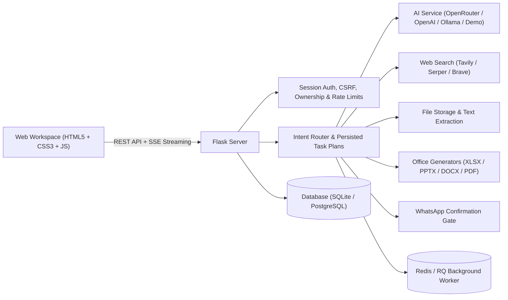

# NexaChat AI — Intelligent Workspace for Research, Documents & Automation
vercel=https://nexachat-ai-two.vercel.app/ 
Render=https://nexachat-ai-e47r.onrender.com
NexaChat AI is a modern, full-stack multimodal AI productivity platform built for real-world execution. It combines streaming AI model access (OpenRouter, OpenAI, local Ollama), source-backed web research, document analysis, automated Office file creation (Excel, PowerPoint, Word, PDF), voice interaction, private contacts, and confirm-before-send WhatsApp messaging.

Designed with a sleek SaaS aesthetic, NexaChat AI provides both a high-converting Landing Page and an interactive AI Workspace.

---

## 🌟 Key Features

- **Multi-Model Intelligence**: Support for OpenRouter (free & paid models), OpenAI (`gpt-5-mini`, `gpt-4.1-mini`), local Ollama (`llama3.2`), or deterministic zero-key Demo mode.
- **Plan-First AI Task Orchestration**: Complex user requests are parsed into clear, step-by-step task execution plans with user approval gates before running tools.
- **Real-Time Web Research**: Integrated live search via Tavily, Serper, or Brave API with verified citations and retrieval dates.
- **Automated Office Artifacts**: Generate downloadable `.xlsx` workbooks (with formulas & charts), 16:9 `.pptx` slides, `.docx` reports, `.pdf` documents, and `.mp3` audio files.
- **Secure File Analysis**: Upload PDF, DOCX, PPTX, XLSX, CSV, JSON, images, and audio files for immediate text extraction and numeric analysis.
- **Voice Messages & Speech**: Voice recording with wave visualization, pause/resume, audio preview, Whisper transcription, and text-to-speech auto-response.
- **WhatsApp Integration**: Contact management with Fernet encryption, CSV import, and an explicit confirm-before-send gate for WhatsApp Cloud API.
- **Modern UI/UX**: Redesigned futuristic interface with landing page view, dark/light themes, smooth entrance animations, mobile navigation drawer, and workspace analytics dashboard.

---

## 🏗️ Architecture Overview



---

## 🛠️ Technology Stack

- **Backend**: Python 3.12, Flask, SQLAlchemy, Alembic, OpenAI SDK (OpenRouter-compatible), Gunicorn, RQ
- **Frontend**: Vanilla CSS3, Modern JavaScript (ES6+), Server-Rendered HTML5 Jinja Templates, SSE (Server-Sent Events)
- **Database & Cache**: SQLite (local dev) / PostgreSQL (production), Redis (rate limiting & background jobs)
- **Document Processing**: `openpyxl`, `python-pptx`, `python-docx`, `reportlab`, `pypdf`, `beautifulsoup4`
- **Security**: Fernet symmetric encryption, CSRF protection, sanitized HTML/Markdown rendering, path traversal prevention

---

## 📁 Repository Structure

```text
nexachat-ai/
├── app/
│   ├── routes/
│   │   ├── api.py           # Core conversation & health API endpoints
│   │   ├── web.py           # Web page router (index template)
│   │   └── workspace.py     # Plans, uploads, artifacts, contacts, WhatsApp API
│   ├── services/
│   │   ├── ai.py            # OpenRouter / OpenAI / Ollama / Demo streaming service
│   │   ├── artifacts.py     # Office file generators (Excel, PPT, Word, PDF)
│   │   ├── files.py         # File validation, storage & text extraction
│   │   ├── orchestrator.py  # Task planner & tool execution engine
│   │   ├── security.py       # Fernet encryption & contact protection
│   │   └── whatsapp.py      # Meta WhatsApp Cloud API integration
│   ├── config.py            # Environment configuration
│   ├── extensions.py        # SQLAlchemy, Limiter, Prometheus metrics
│   └── models.py            # Database schemas
├── static/
│   ├── css/styles.css       # Complete UI/UX design system & animations
│   └── js/app.js            # Frontend state manager, streaming & event handlers
├── templates/
│   └── index.html           # Main landing & app shell template
├── tests/                   # Pytest test suite
├── Dockerfile               # Production Docker container definition
├── docker-compose.yml       # Full stack (App, Worker, Postgres, Redis)
├── render.yaml              # Render backend deployment config
├── app.py                   # Local development server entrypoint
└── wsgi.py                  # WSGI entrypoint for Gunicorn
```

---

## 🚀 Local Development Setup

### Backend & Workspace

1. **Clone & navigate to project**:
   ```bash
   cd nexachat-ai
   ```

2. **Create and activate Python virtual environment**:
   - **Windows (PowerShell)**:
     ```powershell
     python -m venv .venv
     .\.venv\Scripts\Activate.ps1
     ```
   - **macOS / Linux**:
     ```bash
     python3 -m venv .venv
     source .venv/bin/activate
     ```

3. **Install dependencies**:
   ```bash
   pip install -r requirements.txt
   ```

4. **Setup environment file**:
   ```bash
   cp .env.example .env
   ```

5. **Initialize database & run development server**:
   ```bash
   flask --app app.py db upgrade
   python app.py
   ```

6. **Open browser**:
   - Web App: `http://localhost:5000`
   - Health Check: `http://localhost:5000/health`

---


## 🔑 Environment Variables Reference

Edit the repository-root `.env` file to configure OpenRouter. The API key is backend-only.

```env
# Server Configuration
APP_URL=http://localhost:5000
FRONTEND_URL=http://localhost:5000
PORT=5000
SECRET_KEY=dev-only-change-me-in-production

AI_PROVIDER=openrouter
AI_DEMO_MODE=false
OPENROUTER_API_KEY=sk-or-v1-replace_with_real_key
OPENROUTER_BASE_URL=https://openrouter.ai/api/v1
OPENROUTER_MODEL=openrouter/free

# Web Research: tavily | serper | brave | demo
SEARCH_PROVIDER=demo
TAVILY_API_KEY=

# Database & Cache (Optional - defaults to SQLite)
DATABASE_URL=
REDIS_URL=
```

---

## 🐳 Docker Support

To launch the full architecture (App, RQ Worker, PostgreSQL, Redis) using Docker:

```bash
docker compose up --build
```

Access the application at `http://localhost:5000`.

---

## 🌐 Deployment Readiness

### Render Deployment (Backend & Monolith)

NexaChat AI includes a production-ready `render.yaml` configuration.

1. Connect your repository to Render.
2. Render will automatically detect `render.yaml` and provision:
   - Web Service running Docker runtime (`gunicorn wsgi:app`)
   - Managed PostgreSQL Database
   - Managed Redis Instance
3. Set `OPENROUTER_API_KEY` in the Render Dashboard.
4. Health check URL: `/health`.

### Vercel Deployment (Frontend Static / SPA)

If splitting the frontend into a standalone Vercel app in the future:
1. Set `FRONTEND_URL` in backend `.env` to your Vercel domain to allow CORS.
2. Point frontend API requests to your Render backend URL.

---

## 🧪 Testing

Run the automated test suite:

```bash
pytest tests/ -v
```

---

## 📜 License & Authors

- **License**: MIT
- **Author**: NexaChat AI Team
