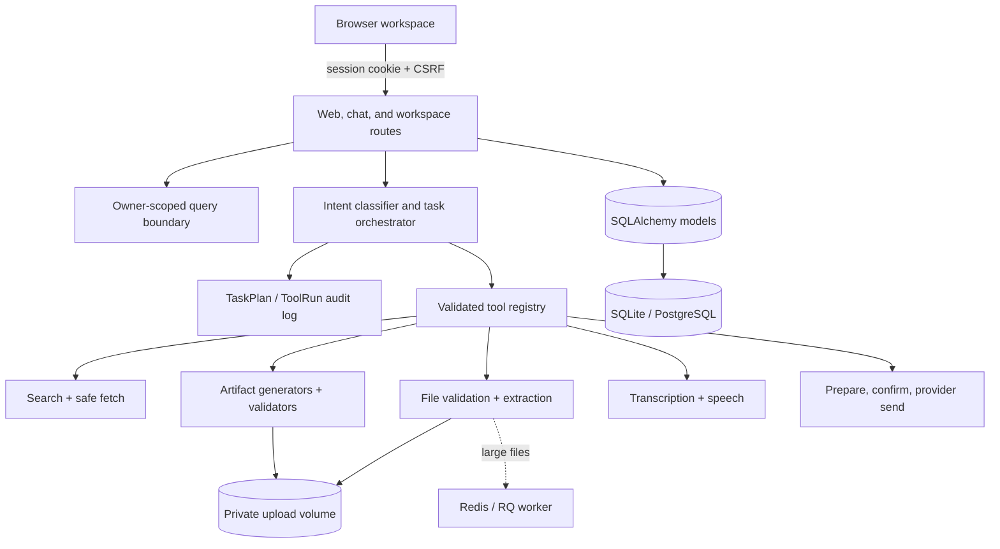
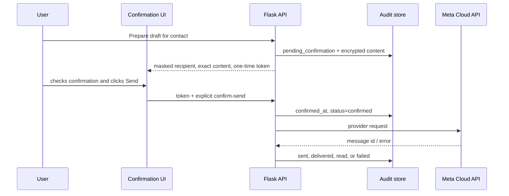

# Architecture

## System shape

NexaChat uses a Flask application factory with a server-rendered shell and framework-free JavaScript client. REST endpoints handle state changes; Server-Sent Events (SSE) carry chat tokens and task progress. SQLAlchemy owns durable state, Redis provides distributed rate limiting and optional RQ extraction jobs, and all provider integrations sit behind service boundaries.

## Request lifecycles

### Direct chat

1. `/api/config` establishes a browser session and returns its CSRF token.
2. A message is validated, model-allowlisted, owner-scoped, rate-limited, and persisted.
3. Requests that imply current facts are rejected with `requires_plan=true`; they cannot bypass live research.
4. `AIService` selects OpenAI, Ollama, or deterministic demo behavior.
5. Tokens stream as SSE and the completed message, provider, model, token counts, and latency are committed.

### Multi-step task

1. The orchestrator classifies intent and creates a persisted `TaskPlan` and ordered steps.
2. The client renders the plan before execution.
3. Execution validates every tool input against its JSON Schema and creates a `ToolRun`.
4. Progress events describe planning, searching, fetching, extracting, generating, validating, and completion.
5. Research sources, artifacts, tool status, latency, and errors remain auditable.
6. The resulting answer uses Markdown citations and owned download routes.

### WhatsApp action

There is no auto-send path. The provider method rejects a record without both `confirmed_at` and `status=confirmed`.

## Domain model

| Model | Responsibility |
|---|---|
| `User` | Guest or registered owner identity |
| `Conversation`, `Message`, `ConversationState` | Chat history, pin/archive state, model metadata |
| `TaskPlan`, `ToolRun` | Persisted plan, steps, tool inputs/outputs, status, latency |
| `UploadedFile` | Owner, checksum, MIME, path, extraction state and text |
| `Artifact` | Generated file metadata, source metadata, validation state |
| `ResearchSource` | URL, title, snippet, retrieval timestamp, plan ownership |
| `Contact` | Encrypted phone/email, deterministic duplicate lookup hash |
| `WhatsAppMessage` | Confirmation and provider delivery audit trail |
| `UserPreference` | Language, document style, theme, TTS choice, explicit memory |
| `UsageEvent` | Operational counts, latency, token and optional cost estimates |

Legacy `Conversation` and `Message` tables remain compatible. The additive migration creates the multimodal workspace tables without deleting existing chats.

## Trust boundaries

- Browser text, uploaded files, search results, extracted document text, and webhook bodies are untrusted.
- CSRF is required for browser mutations; authorization is repeated server-side with `owner_id`.
- Tool arguments use strict JSON Schemas and additional semantic validation.
- Search content is wrapped in explicit “untrusted content” delimiters before model use.
- URL fetching rejects unsupported schemes, credentials, loopback, link-local, private, reserved, and DNS-rebinding targets. Redirects are revalidated.
- Upload validation uses extension, content signature, Office ZIP structure, decompression ratio/size, maximum bytes, and owner-only storage.
- Contact identifiers are encrypted at rest; phone hashes support duplicate detection without plaintext lookup.
- Artifact downloads use database ownership and generated identifiers, not arbitrary paths.
- External messaging is a distinct prepare/confirm/send state machine.

## Artifact pipeline

Generators accept structured data rather than arbitrary executable templates.

- XLSX: styled tables, freeze panes, filters, number formats, conditional formatting, charts, source/metadata sheets, and formula-injection escaping.
- PPTX: 16:9 layouts, visual hierarchy, agenda/content/source slides, consistent theme, and structural validation.
- DOCX: cover, contents section, semantic headings, tables, page numbers, and references.
- PDF: reusable report components, page footers, tables, references, and renderable output.

Each artifact is reopened by its native library after creation. Tests assert expected sheet/slide/section counts and source metadata.

## Availability and scale

- SQLite and in-process rate limits are suitable for one local process.
- Production uses PostgreSQL and Redis so multiple Gunicorn processes share durable state and limits.
- Uploads/artifacts require a mounted private volume on every process. Horizontal scaling needs a shared private filesystem or a future object-storage adapter.
- Long extraction crosses a configured threshold and is queued to RQ. Synchronous extraction remains available for small files and no-Redis demos.
- SSE is intentionally one-way and HTTP-native. A reverse proxy must disable buffering and allow a request timeout long enough for tool tasks.

## Observability

Health: `/api/health`; readiness: `/api/ready`; metrics: `/metrics`.

Prometheus counters/histograms include AI calls, tokens, latency, and tool calls. Task plans and tool runs provide per-user product analytics without placing prompt bodies in log messages. Request IDs and structured log fields support correlation.

## Intentional limitations

The current release does not implement native PPTX speaker notes, S3-compatible storage, inbound WhatsApp chat, Meta template management, OAuth/SSO, billing, or shared team workspaces. These are documented boundaries rather than simulated controls.
